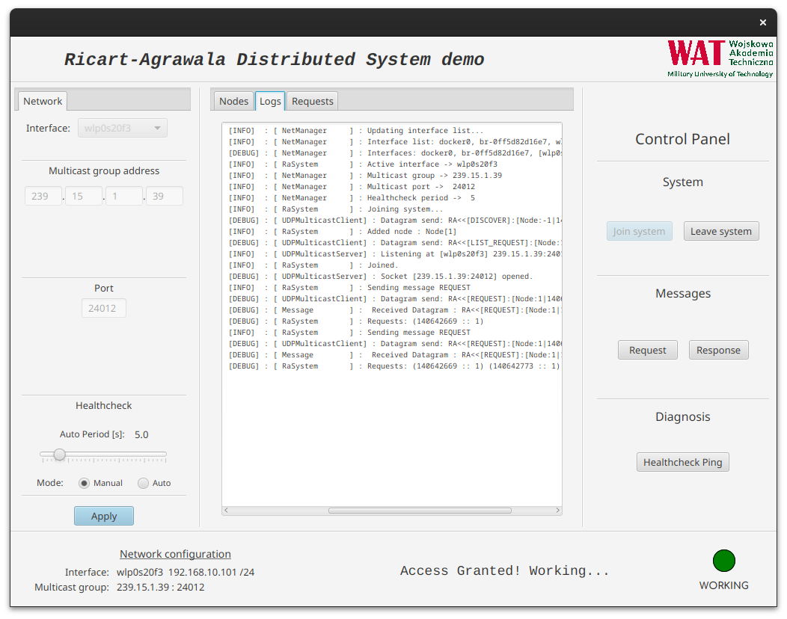

# Ricart-Agrawala_demo-DS

## *Ricart-Agrawala algorithm - distributed system demostration*

## **Content**

1. [Overview](#overview)

    1.1.[Description](#description)

    1.2. [Features](#features)

    1.3. [Notes](#notes)

    1.4. [Screenshots](#screenshots)

2. [Algorithm](#algorithm)

3. [Use guide](#use-guide)

    3.1. [Installation on Linux](#installation)

    3.1. [Installation on Windows](#installation)

    3.1. [Run guide](#run-guide)

4. [Documentation](docs/)

---

## **Overview**

### Description

A ***Military University of Technology*** student project from the ***Distributed Systems*** course, implementing the **Ricart and Agrawala** algorithm in **Java**. This algorithm is employed to achieve mutual exclusion (mutex) in distributed environments where multiple processes share resources.

### Features

1. Implementation of the Ricart and Agrawala algorithm in **Java**.
2. Graphical User Interface developed with **JavaFX** framework.
3. Demonstration of mutual exclusion mechanism in distributed systems.
4. Sample use cases illustrating process synchronization.
5. Code documentation and installation instructions.

### Notes

- The project is intended for educational purposes.
- The code is optimized for readability and understanding.
- The repository can serve as a starting point for exploring distributed systems and synchronization algorithms.

### Screenshots

> Application main window - *SceneBuilder* screenshot

---

## **Algorithm**

When a process `Pi` wishes to enter the critical section, it sends a timestamped request message to all processes in its request set. Upon receiving a request from process `Pi`, process `Pj` sends a `RESPONSE` message to `Pi` unless one of the following conditions is met: 

1) `Pj` is currently executing its critical section, 

2) `Pj` has requested entry into the critical section, and the timestamp of its request is smaller than the timestamp of `Pi`'s request. 

If either condition is true, `Pi`'s request is deferred and placed in the queue in process `Pj`.

Process `Pi` enters the critical section after receiving `RESPONSE` messages from all processes in its set Ri. When `Pi` finishes executing the critical section, it sends responses to all previously deferred requests, subsequently removing them from the queue.

Responses to a process's requests are only blocked by processes vying for entry into the critical section with a higher priority, indicated by a smaller timestamp. Consequently, when a process replies to all deferred requests, the process with the next highest priority in the request queue receives the last necessary response and enters the critical section. In other words, critical sections in the Ricart and Agrawal algorithm are executed in order based on the timestamp values of their requests.

---

## **Use Guide**

### Installation on Linux

> *To do ...*

### Installation on Windows

> *To do ...*

### Run guide

> *To do ...*